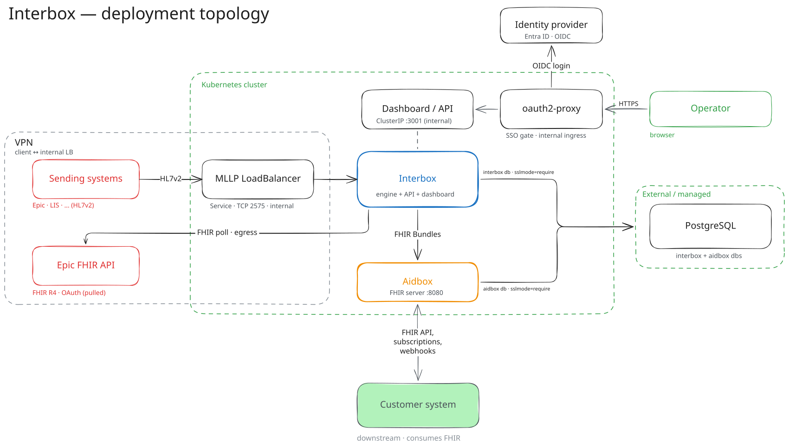

# Deployment

Interbox ships as one all-in-one image (engine + API + dashboard). It always
needs two things it does **not** bundle: a **PostgreSQL** database and an
**Aidbox** endpoint (see [System Requirements](sizing.md) for sizing).



*Editable source: [`interbox-topology.excalidraw`](../../assets/interbox-topology.excalidraw) — open it at [excalidraw.com](https://excalidraw.com) to update the diagram, then re-export the PNG.*

Two supported ways to run it:

- **Docker Compose** — the fastest path for a single host or evaluation. The
  workspace template's `docker-compose.yaml` brings up Interbox, Postgres, and
  Aidbox together; see [Getting Started](../getting-started.md).
- **Kubernetes (Helm)** — the production path.

## Kubernetes (Helm)

The chart lives in [`HealthSamurai/helm-charts`](https://github.com/HealthSamurai/helm-charts)
(`interbox/` directory), and **its own docs are the source of truth** — kept
current with the chart. This page does **not** re-document values, secret keys,
or per-cloud overlays; go there for the reference:

- [**Chart README**](https://github.com/HealthSamurai/helm-charts/tree/main/interbox) —
  the full values table, install command, and setup scenarios (managed PG,
  reusing Aidbox's cluster, sibling charts, locked-down PG).
- [**PREREQUISITES.md**](https://github.com/HealthSamurai/helm-charts/blob/main/interbox/PREREQUISITES.md) —
  Postgres and Aidbox requirements, the secret keys, TLS, and MLLP exposure.

The one-liner to get going:

```console
helm repo add healthsamurai https://healthsamurai.github.io/helm-charts
helm upgrade --install interbox healthsamurai/interbox \
  --namespace interbox --create-namespace \
  --values values.yaml
```

## What's different about deploying Interbox

The chart's defaults encode a few things that are unusual for a web app and easy
to get wrong if you treat Interbox like a generic stateless service. These come
from how the engine works, so they are documented here rather than in the chart:

- **Single replica, `Recreate` rollout.** There is one MLLP TCP listener and one
  boot-time workspace build, so two pods must never run at once. Horizontal
  scaling (HA) is deferred — **scale vertically**, and expect a brief stop-then-
  start on every upgrade rather than a rolling one.
- **MLLP is raw TCP, so it gets its own LoadBalancer** — HTTP ingress can't carry
  it. It's meant to be a *private* LB reached over a VPN/VNet. **Pin its IP**: a
  dynamic LB address can change on reinstall and break the firewall/VPN rules the
  sending hospital built around it. That stable address is the one networking
  detail worth agreeing with DevOps up front.
- **The dashboard is internal-only.** It's a `ClusterIP` — reach it with a
  port-forward, or an *internal* ingress class for a stable hostname. Never
  expose it publicly.
- **The pod builds the workspace on boot** (clone + `bun install` + `Bun.build`).
  That makes boot memory-hungry, so don't set a tight memory limit — a tight one
  OOM-kills the pod during startup. The chart's startup probe is deliberately
  generous to cover it.
- **Migrations run on boot.** An upgrade is just a new image tag; the pod
  migrates the database as it comes up. The engine also self-creates its
  `interbox` database when the `DATABASE_URL` user has `CREATEDB` (otherwise
  pre-create it — see PREREQUISITES).
